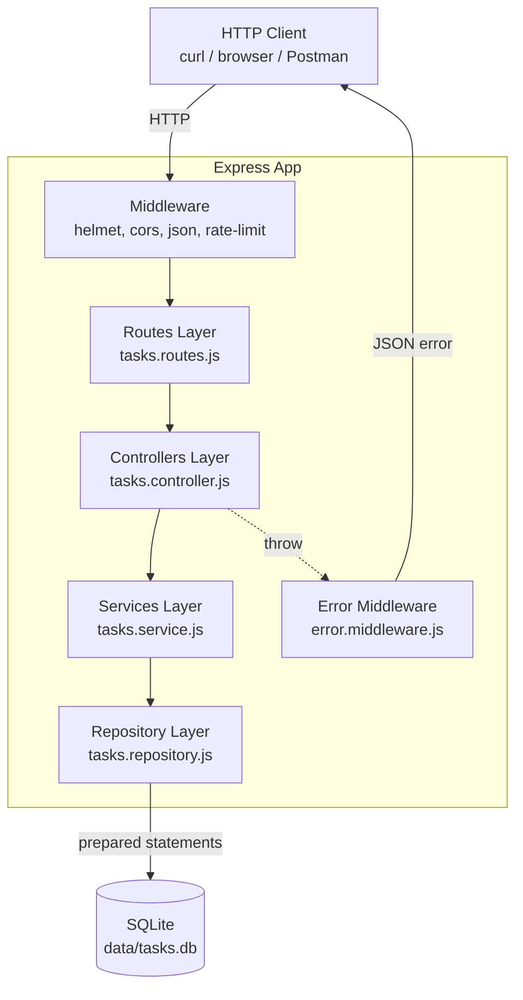
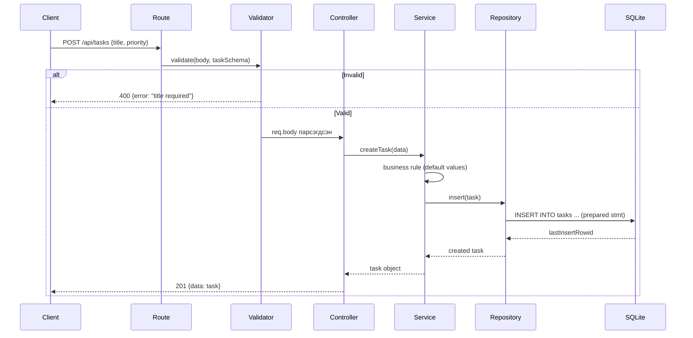
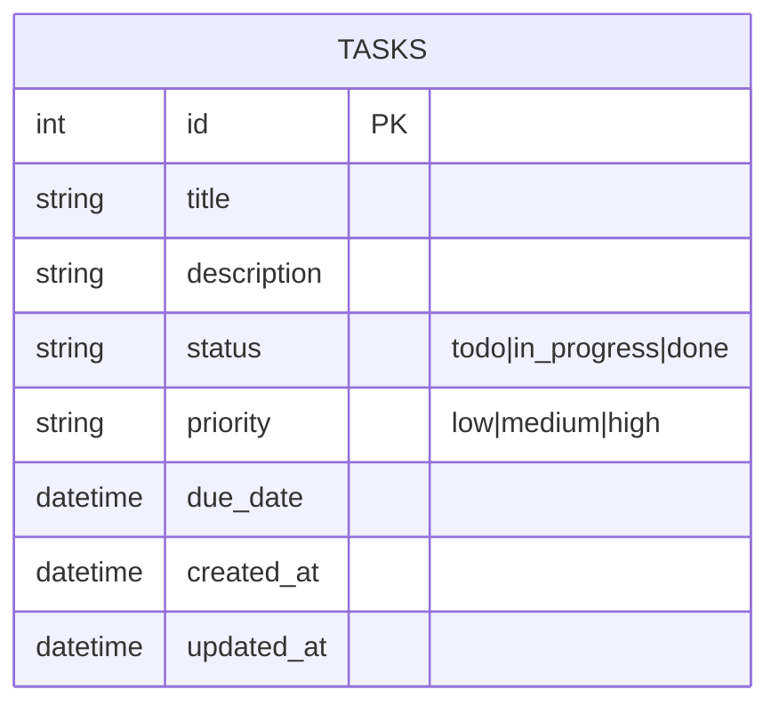

# ARCHITECTURE.md — Personal Task Tracker

## Layer-н архитектур

Систем нь **layered architecture**-аар бүтэцлэгдсэн. Layer бүр зөвхөн доод layer-ээ дуудана.



## Module-уудын тайлбар

| Layer | File | Үүрэг |
|-------|------|-------|
| **Routes** | `routes/tasks.routes.js` | URL → controller mapping. Validation schema холбох. |
| **Controller** | `controllers/tasks.controller.js` | HTTP req/res handling. Service дуудаад response буцаах. |
| **Service** | `services/tasks.service.js` | Business logic. Жишээ: status transition rule. |
| **Repository** | `repositories/tasks.repository.js` | SQL query, DB-тэй ярих ганц layer. |
| **Validation** | `validation/tasks.schema.js` | Zod schema — request body, query шалгах. |
| **DB** | `db/index.js` | better-sqlite3 connection, migration. |
| **Middleware** | `middleware/error.middleware.js` | Global error handler, 404, validation error format. |
| **Server** | `app.js`, `server.js` | Express setup ба listen хийх (тестийн төлөө хуваасан). |

## Data flow жишээ — `POST /api/tasks`



## Data model



## Folder бүтэц (partB/)

```
partB/
├── src/
│   ├── app.js                     # Express app үүсгэх (test-д import)
│   ├── server.js                  # listen() хийх entry point
│   ├── db/
│   │   ├── index.js               # connection
│   │   └── migrations.sql         # schema
│   ├── routes/
│   │   └── tasks.routes.js
│   ├── controllers/
│   │   └── tasks.controller.js
│   ├── services/
│   │   └── tasks.service.js
│   ├── repositories/
│   │   └── tasks.repository.js
│   ├── validation/
│   │   └── tasks.schema.js
│   └── middleware/
│       ├── error.middleware.js
│       └── validate.middleware.js
├── tests/
│   ├── tasks.service.test.js
│   ├── tasks.repository.test.js
│   └── tasks.api.test.js          # supertest-ээр integration
├── package.json
├── openapi.yaml
└── README.md
```

## Дизайны зарчмууд

1. **Single Responsibility** — Layer бүр нэг үүрэгтэй.
2. **Dependency direction** — Доош л чиглэнэ. Repository нь Service-ийг мэдэхгүй.
3. **Testable** — Service-ийг repository mock-той тестлэх боломжтой.
4. **No leaky abstraction** — Controller SQL мэдэхгүй, Repository HTTP мэдэхгүй.
